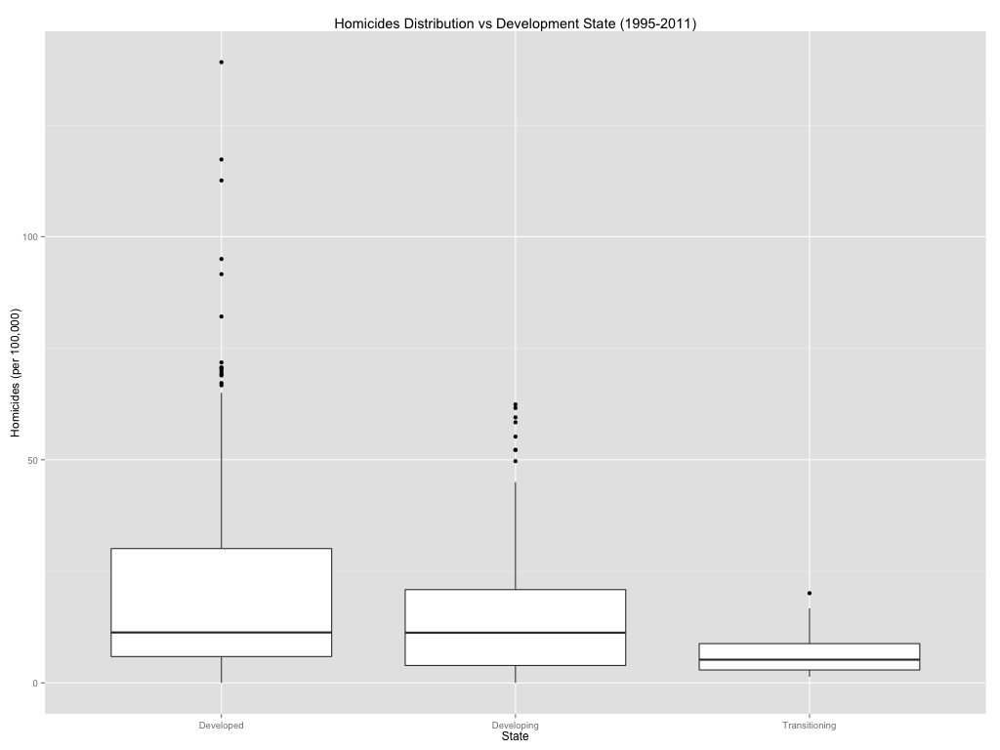
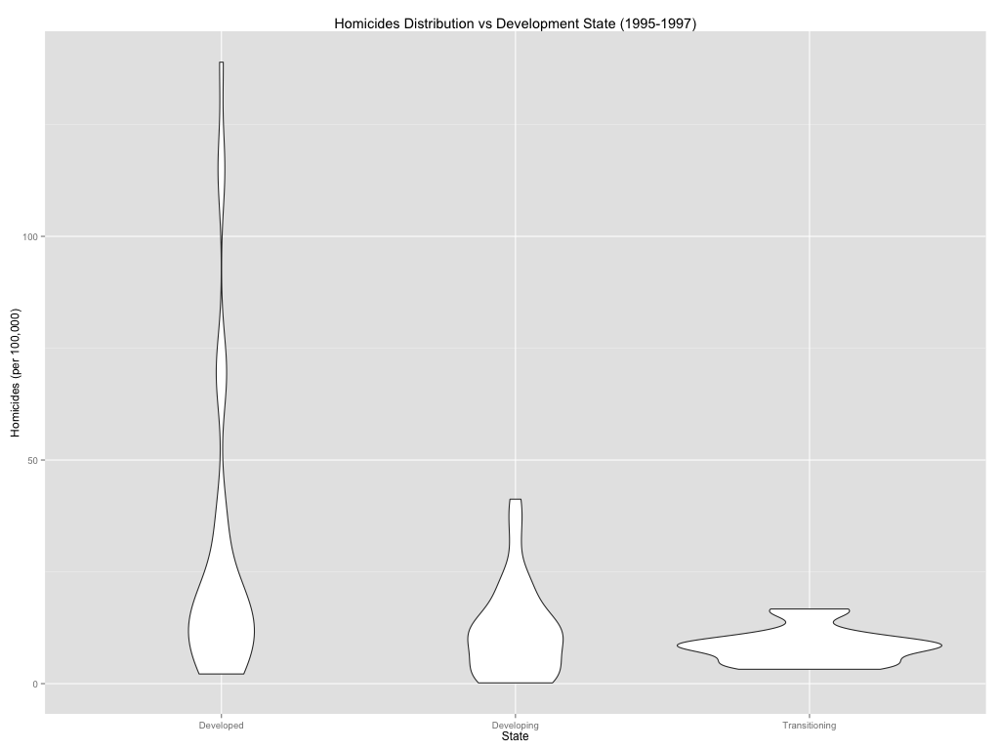
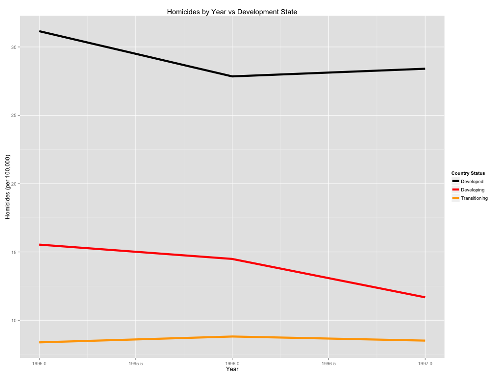
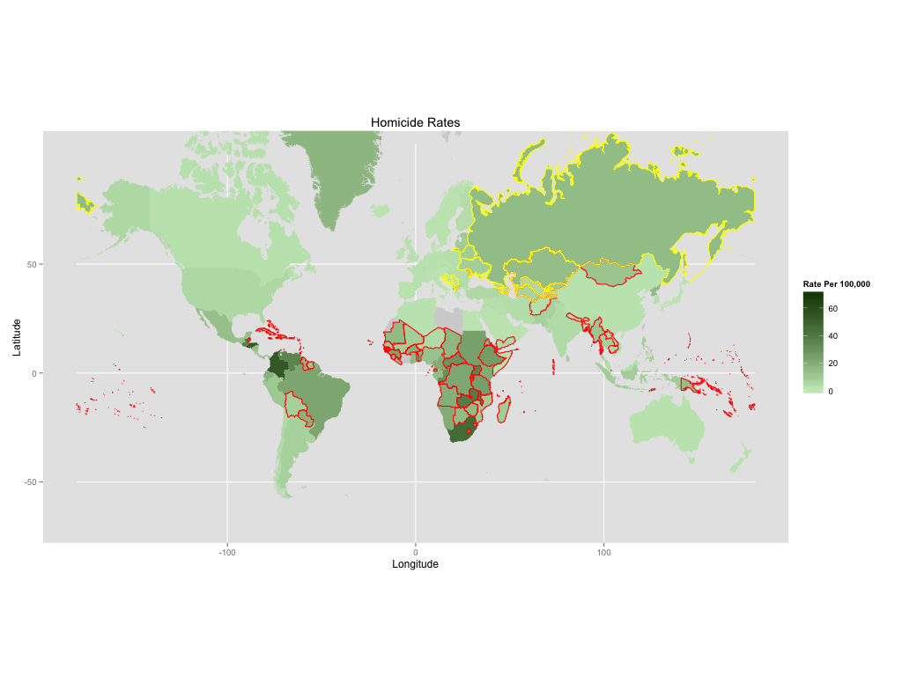
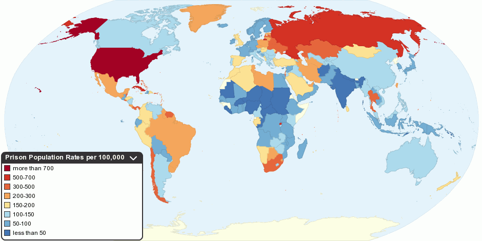
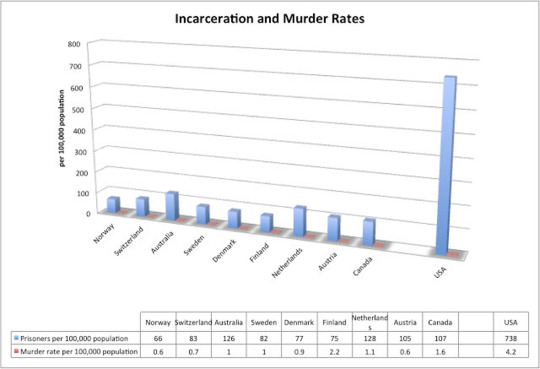

% Final Project - Homicide Rates
% Clinton McKay
% Dec. 6, 2013

# Overview

  1. Hypothesis
  2. Data
  3. My Visuals
  4. Other Visuals
  5. Sources

# Hypothesis
  
  - Homicide rates are not affected by the development status of the country. 

# Data
  - Homicide data acquired from the UN Data website.

# My Visuals
  - Supporting Visuals
  - Refuting Visuals

# Supporting Visual

# Supporting Visual

# Supporting Visual

# Refuting Visual

# Other Visuals

  - Good Visual
  - Bad Visual

# 

#

# Sources

  - [Good Visual Website](http://chartsbin.com/graph/drugs_and_crime)
  - [Bad Visual Website](http://www.goodreads.com/author_blog_posts/3439753-the-nine-best-run-countries-in-the-world-what-they-have-in-common-and)

